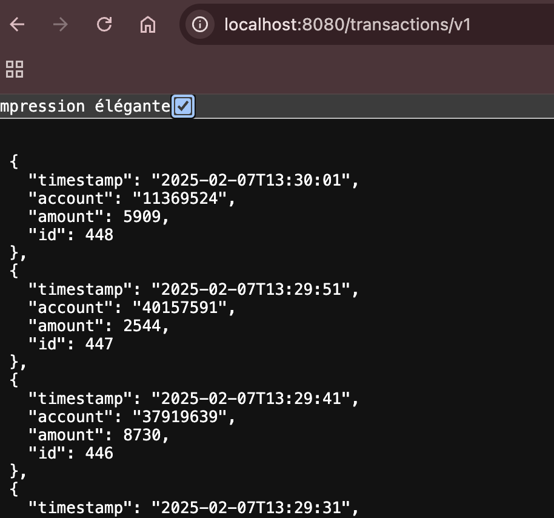

Basic example of using CAMEL REST DSL with an OpenAPI Schema for a contract-first API approach

The path, URL and specification is abstrated and separated from the implementation

The path is defined in te OpenAPI document: [path](https://github.com/masauve/camel-account-pipeline/blob/290ffa217c73426bf8de5089ce6f3a0853ea5360/openapi/open-api.v1.schema.yaml#L10)

the implementation is linked to the specification by operationId:

Specification: [operationId](https://github.com/masauve/camel-account-pipeline/blob/290ffa217c73426bf8de5089ce6f3a0853ea5360/openapi/open-api.v1.schema.yaml#L20)

Implementation: [direct:](https://github.com/masauve/camel-account-pipeline/blob/59200433bad15189fc53aa8b7c3084c8f737897d/openapi/restopenapi-endpoints.camel.yaml#L36)

To execute:

```

jbang '-Dcamel.jbang.version=4.5.0' camel@apache/camel run restopenapi-endpoints.camel.yaml --dev --logging-level=info --open-api=open-api.v1.schema.yaml

```


When the backend (DB) is available, you should see something like that:



